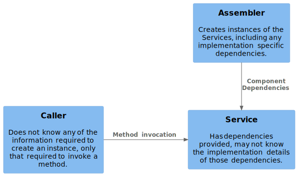

# Refactoring 201

Let's turn our focus back to `evidenceService.ts`. Having seen how the service is created in the Assembler (top-level `index.ts`), you may see a reasonable pattern for creating the server emerging:

1. Read configuration from the environment.
2. Use configuration to satisfy the dependencies of the `EvidenceService` and create an instance of it.
3. Use the service instance to satisfy the dependencies of the `buildFastifyServer` function and create an instance of `FastifyServer`.
4. Start that server.

We can invert this and think instead that our goal is to create an instance of the server then work backwards through the dependencies that we need.

1. An alternative pattern may be to pass the `EvidenceServiceConfiguration` into `buildFastifyServer` and provide the necessary configuration as parameters when `EvidenceService+fileUpload` is called. What would be the advantages and disadvantages of this approach?

Martin Fowler [described three types of dependency injection](https://martinfowler.com/articles/injection.html#FormsOfDependencyInjection):

1. Which type of Dependency Injection have we adopted in this solution?

## Splitting up the Evidence Service

The `EvidenceService` is doing a lot of work in our implementation at the moment. Referring back to our original list of concerns, after our configuration refactor, responsibilities are allocated per:

| What                     | Where      | When |
| ---- | --- | --- |
| Read environment and parse configuration | Assembler | Creation |
| Create `EvidenceService` | Assembler (top-level `index.ts`) | Creation |
| Create routes            | Assembler | Creation |
| Start server             | Assembler | Creation |
| Parse incoming request from HTTP to domain-specific type | Route Handler (`server.ts`) | Usage |
| Call virus scanning service | `EvidenceService` | Usage |
| Interprets the results to decide what to do. | `EvidenceService` | Usage |
| Uploads the content to S3. | `awsService.ts` | Usage |
| Sometimes, updates MongoDBwith the metadata. | `EvidenceService` | Usage |
| Translate domain-specific response to HTTP response | Route Handler | Usage |


Not only is the `EvidenceService` doing the bulk of the work, but it is also tied to (and has intimate knowledge of) the current implementations for virus scanning, uploading content and storing (and reading) metadata.

The refactoring that we did earlier gives us a clear picture of the internals of `EvidenceService+uploadFile`, so we can make informed decisions about how to split it apart.

On that basis, let's split the EvidenceService into more pieces:

* A `MetadataService` that provides methods to write and read metadata.
* A `VirusScanningService` that provide a method to scan content.

Let's also refactor `awsService.ts` to be a class that we can construct an instance of it.

As we don't want `EvidenceService` to know the implementation details of these new services, we are going to instantiate them in the Assembler and pass them to the `EvidenceService` constructor.

1. Do you agree that these new services should be created by the Assembler? When would you *not* want to do it this way?
2. Is it reasonable to hide the implementation details of these services from the `EvidenceService`? What implementation details should you not try to hide?

## MetadataService

Starting with the `MetadataService`, create a new file `metadataService.ts` and define a new class:

```typescript
export type MetadataServiceConfiguration = {
};

export class MetadataService {

  readonly configuration: MetadataServiceConfiguration;

  constructor(configuration: MetadataServiceConfiguration) {
    this.configuration = configuration;
  }
```

Then grab the functions that relate to handling metadata and convert them to methods of that class.

You'll notice that those methods currently accept 'configuration' info (e.g. the mongodb username and password) in their parameters. That configuration is implementation specific and shouldn't be controlled by the caller - it should be provided by the Assembler when the `MetadataService` is instantiated.



Move that configuration out of the method parameters into the constructor's configuration type.

You should be able to remove MongoDBspecific configuration from `EvidenceServiceConfiguration`. Update the constructor of `EvidenceService` to take an instance of `MetadataService` and call that service in `handleCleanFile`.

1. What else do you need to update to have the service compile and start successfully?

Make that change, test the service and verify that it all works.

2. Draw a diagram of the 'dependency graph' at this point? Is it getting taller or shorter?
3. Is `EvidenceService` getting smaller or larger? Is it becoming more or less complex? How do we measure complexity of a class or function?
3. Is it easier or harder to read `evidenceService.ts` and understand what the solution does?

## Virus Scanning Service and AWS Service

You should be able follow the same process as before to create a new Virus Scanning Service and refactor `awsService.ts` to be a class.

1. Draw a diagram of the 'dependency graph' at this point? Is it getting taller or shorter?
2. What is left in the `EvidenceServiceConfiguration`?

## Another Service?

`EvidenceService` is now getting quite small. It orchestrates the virus scanner, metadata and AWS services to perform work. Besides that, it only has one responsibility: interpret the results of the virus scan and decide what to do next. That decision is very simple.

In some cases, decisions may be much more complex. It may be that whether to quarantine the file depends on more factors:

* size or format of the file
* whether it appears to contain objectionable content
* whether it appears to contain copyrighted content
* per-user settings that affect our interpretation of the above

We can imagine a function like:

```typescript
const shouldQuarantine(infected: boolean, size: number, format: FileFormat, objectionable: boolean, copyrighted: boolean, customerDetails: CustomerAgreement): boolean => {
  // LOTS OF COMPLEX RULES HERE
}
```

Such a function may well be better extracted into another Service and passed into the `EvidenceService`. Doing so allows us to thoroughly test that the rules operate as expected.

In this case, the rule is simple enough that we are happy to leave it as part of the `EvidenceService`.

## Wrapping up

After this refactor the responsibilities are:

| What                     | Where      | When |
| ---- | --- | --- |
| Read environment and parse configuration | Assembler | Creation |
| Create services[^1] | Assembler (top-level `index.ts`) | Creation |
| Create routes            | Assembler | Creation |
| Start server             | Assembler | Creation |
| Parse incoming request from HTTP to domain-specific type | Route Handler (`server.ts`) | Usage |
| Orchestrate other services[^2] | `EvidenceService` | Usage |
| Call virus scanning service | `VirusScanningService` | Usage |
| Interprets the results to decide what to do. | `EvidenceService` | Usage |
| Uploads the content to S3. | `AwsService` | Usage |
| Sometimes, updates MongoDBwith the metadata. | `MetadataService` | Usage |
| Translate domain-specific response to HTTP response | Route Handler | Usage |

This is starting to look at lot more reasonable.

1. What is the cyclometric complexity of the `fileUpload` method?
2. What are the branches?
3. Does the implementation provide better log messages or responses when receiving good and bad requests?

[^1]: Note that we've generalised this from "Create `EvidenceService`".
[^2]: A new responsibility.