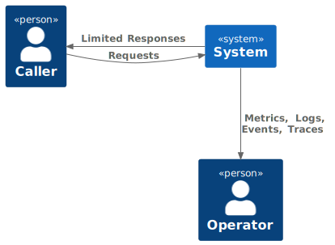

# Error Handling

Another two responsibilities not performed well are:

| What                     | Where      | When |
| ---- | --- | --- |
| Parse incoming request from HTTP to domain-specific type | Route Handler (`server.ts`) | Usage |
| Translate domain-specific response to HTTP response | Route Handler | Usage |

This is partly because the two service methods that are  called by the Route Handler (`EvidenceService+uploadFile` and `+fetchDetails`) don't provide the necessary domain specific information for the Route Handler to return good information to the caller.

Before we start improving our implementation, let's first consider whether it is appropriate for the Route Handler to translate from the domain-specific response to a HTTP one (and for the `EvidenceService` to be unaware of HTTP).

Generally, we consider that it *is* appropriate for the Route Handler to own this responsibility and for services to be unaware of the specifics of the HTTP request and response - services should try to return a `404` directly.

Moving on, a reasonable HTTP-driven server should return:
* [an appropriate status](https://en.wikipedia.org/wiki/List_of_HTTP_status_codes)
* useful headers (particularly when throttling)
* a useful response body

Noting that it isn't always correct to be *too* helpful to callers (lest you facilitate an attack), a server should also be observable.



Remind yourself of what happens when you make a request for metadata using an evidence id that does not exist (but is well-formed).

1. Do you receive an appropriate status?
2. Do you receive a useful response?
3. Is a useful message logged?

## Handling 'missing' metadata

Let's take a look at the type of `EvidenceService+fetchDetails` to see what information *is* returned to the Route Handler.

The explicit type is pretty unhelpful:

```typescript
async fetchDetails(evidenceId: string) {
```

Doing a bit of type detecting, we can work out that the type is actually:

```typescript
async fetchDetails(evidenceId: string): Promise<WithId<Document> | null> {
```

Since we don't want MongoDBspecifics (`WithId`, `Document`) bleeding out into the Route Handler, let's hide that for now. Add the explicit type:

```typescript
async fetchDetails(evidenceId: string): Promise<unknown | null> {
```

1. Can you see where the `null` in the response to the `GET` request is coming from?

Moving to the Route Handler, let's use the response from `fetchDetails` to change the HTTP response we send.

Firstly, let's get the machinery in place. Change the guts of the GET handler to:

```typescript
      const result = await evidenceService.fetchDetails(evidenceId);

      return result === null ?
        result :
        result;
```

Then change the `null` branch to return a 404 response with a helpful error message:

```typescript
await reply.status(404).send({
  message: `No metadata for [${evidenceId}].`
})
```

Call the service again.

2. What status code is returned?
3. Is that status code appropriate for given the request that was made?
4. What response body was returned?
5. Do you think that response body is appropriate?

## Handling internal errors
Change the servers configuration so that the username is invalid and then attempt to fetch some details.

You should get a `500` response code.

1. What response body was returned?
2. Do you think that response body is appropriate?

We mentioned before that throwing an error (e.g. `throw new Error('something failed')`) does not show up in the type system. This is not true for functions and methods that return a `Promise`. Promises do model success and failure.

3. What part of our implementation causes the 'failed' Promise to turn into a thrown Error?
4. What part of the system is handling that error at the moment? Is it code that we have written?
5. Are we logging anything when the error occurs? Does it have helpful context?

Right now the error is bubbling up from the internals of mongo's client library. This means that:
* MongoDBinternals are leaking to callers
* no additional context is added by the `EvidenceService`.

Compare with a logged error that *does* provide additional context and clear causation:

```sh
Error: Failed to get project [MMAMOW2].
    at Object.handler (/Users/dan/dev/agile/atlast/dist/scripts/get-project.js:441:15)
    <snip>
  [cause]: Error: Failed when invoking Jira API.
      at /Users/dan/dev/agile/atlast/dist/scripts/get-project.js:90:16
      <snip>
    [cause]: Error: "Basic authentication with passwords is deprecated.  For more information, see: https://developer.atlassian.com/cloud/confluence/deprecation-notice-basic-auth/\n"
```

If you look at the type signature for `EvidenceService+uploadFile` you'll notice that we explicitly state the promise may return an instance of `Error` (Javascript's [standard error type](https://developer.mozilla.org/en-US/docs/Web/JavaScript/Reference/Global_Objects/Error)):

```typescript
Promise<{ evidence_id: string } | Error>
```

and then the POST handler uses that information:

```typescript
if (processResult instanceof Error) {
  await sendErrorReply(reply)(processResult);
  return;
}
```

Let's follow a similar pattern here. Change the type of `EvidenceService+fetchDetails` to `Promise<unknown | null | Error>`.

Then wrap the part of that method that invokes the `MetadataService` with:

```typescript
    try {
      return ... // <-- Code to invoke the MetadataService goes here.
    } catch (e: unknown) {
      return new Error(`Failed to fetch details of [${evidenceId}].`, 
        { cause: chainableError(e) }
      );
    } 
```

then make the request again.

Send the request again and check the message in the response body.

6. What was the message?
7. Where can you see the `cause` of the error?
8. Do you think that 'wrapping' the original error in this way provides additional, useful context?

Fix the server's configuration and verify that everything works again.

## Handling user errors

Modify your POST request and remove the `base64_content` property.

1. What status code is returned?
2. Is that status code appropriate for given the request that was made?
3. What response body was returned?
4. Do you think that response body is appropriate?

The type that we use for that request is named `UploadRequest` and is defined in `node-services/file-handler/src/types/upload.ts`. `UploadRequest` says that `base64_body` is mandatory and can not be undefined.

5. What part of the server is responsible for converting the HTTP request into an `UploadRequest`?
6. Is it doing a good job?

Let's think about what we would get out of a good translation between the HTTP request and the domain-specific types.

* Good error messages to help us develop and operate.
* Truthful types (e.g. not using `as`).

To make the job of doing this easier, let's use an existing library to do this work.

Install [zod](https://github.com/colinhacks/zod) in the same way that you installed `fastify-metrics`.

We'll add the zod schema in a new file named `codecs.ts`. Create it in the `types` directory.

Once you have the file, add the simplest codec for the `UploadRequest`:

```typescript
import { z } from "zod";

export const UploadRequestSchema = z.object({
    body: z.object({
        action: z.object({
            name: z.string(),
        }),
        input: z.object({
            data: z.object({
                filename: z.string(),
                base64_data: z.string(),
                name: z.string(),
                description: z.string()
            })
        })
    }),
});
```

You'll notice a lot of similarity between this schema and the `UploadRequest` type itself. To avoid duplication, we can derive the type from the schema. To do so, modify `upload.ts` to have:

```typescript
export type UploadRequest = z.infer<typeof UploadRequestSchema>;
```

Now, we have to use that new schema to parse our request[^1].

Change the POST handler to *not* use `as` and instead:

```typescript
const uploadRequest = UploadRequestSchema.parse(request);
```

And send your bad request.

7. Are we getting better error messages from the server?
8. Remove another required property. Do you get information about both missing fields in the response?

You'll note that the status is still inappropriate. When a caller supplies bad data, the server should return a `400` status.

This is because `parse` (although it faithfully returns the type that it says it does) can also throw an error. We *could* catch that error, but it is preferable to use methods don't have holes in their types.

Switch the Route handler to use the method that will parse safely.

```typescript
const uploadRequest = UploadRequestSchema.safeParse(request);
```

Your code should have errors now, because in using `safeParse`, the type of `uploadRequest` has changed.

Add the code to handle the error case and allow TypeScript's flow typing to narrow the type down to the success case:

```typescript
const uploadRequest = UploadRequestSchema.safeParse(request);
if (!uploadRequest.success) {
  return await reply.status(400).send({
    ...uploadRequest.error,
    message: "Failed to parse upload request",
  });
}
```

Send your request again and check that the response contains some great error messages.

9. Do you think it is appropriate to return this level of detail in a production system?
10. Do you think that details of bad requests should be logged?

The [Robustness Principle](https://en.wikipedia.org/wiki/Robustness_principle) states that we should "be conservative in what you send, be liberal in what you accept". 

11. Do you think that we should try to 'repair' bad requests if we can?

## Wrapping up

We've touched on two responsibilities in this section:

| What                     | Where      | When |
| ---- | --- | --- |
| Parse incoming request from HTTP to domain-specific type | Route Handler (`server.ts`) | Usage |
| Translate domain-specific response to HTTP response | Route Handler | Usage |

and significantly improved the behaviour of both.

* We return appropriate statuses ✅.
* We return useful responses for both internal and user errors ✅.
* We haven't found a need to use non-standard response headers 🤔.
* We don't use `as`[^2] when processing incoming requests ✅.

1. What is the appropriate response when the user sends an infected file?

[^1]: Remember to [parse, don't validate](https://lexi-lambda.github.io/blog/2019/11/05/parse-don-t-validate/).
[^2]: Except in the GET handler that we didn't modify.
